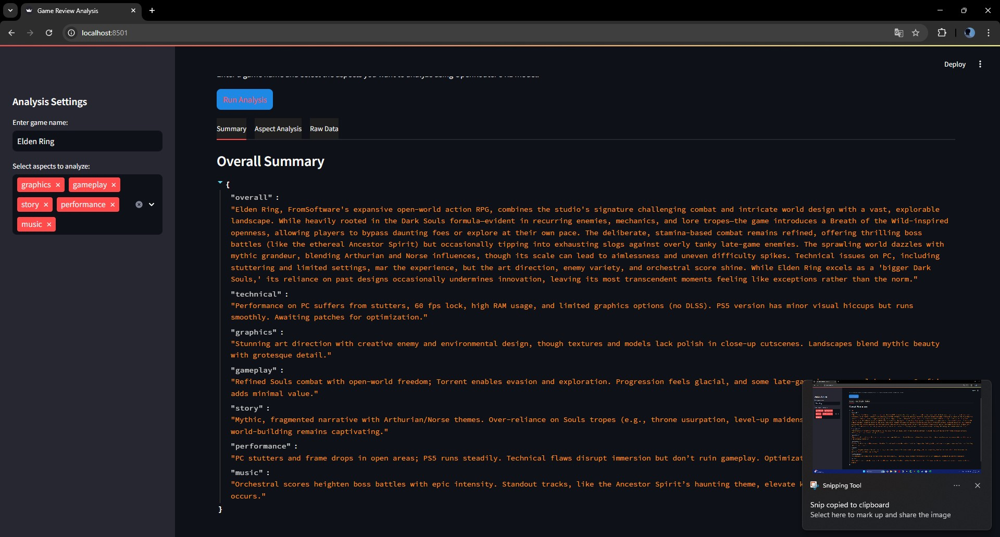
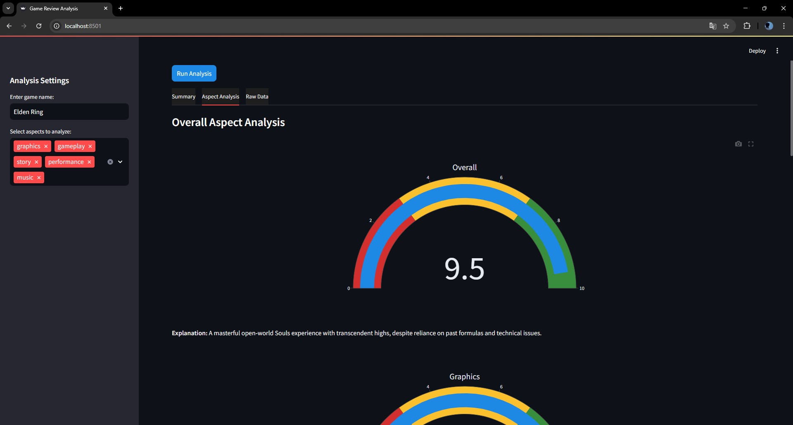

# Game Analysis & Recommendation System
## Project Description
This project combines game recommendations with detailed critic reviews to provide comprehensive gaming insights. It consists of two main components:
1. **GRS (Game Recommendation System)**: Suggests games to Steam users based on their current game library
2. **Critic**: Use LLM API for aggregates and analyzes reviews from major gaming websites (IGN, Eurogamer, etc.) to provide detailed scoring across different aspects and give a overall summery

## Project Structure
```
Game-Analysis-Recommendation/
├── GRS/                    # Game Recommendation System
│   ├── train               # train code for Recommendation System
│   └── app                 # Streamlit app for Recommendation System
├── Critic/                # Critic Review System
│   ├── scrapers/         # Web scrapers for gaming sites
│   └── analysis/         # Review analysis and scoring
└── app/                  # Streamlit web application
```

## Installation Instructions
1. **Clone the repository:**
```sh
git clone https://github.com/Har2yQn78/Game-Analysis-Recommendation.git
cd Game-Analysis-Recommendation
```

2. **Install the required packages:**
```sh
pip install -r requirements.txt
```

3. **Download the datasets:**
   - For Recommendation System:
     - Visit [UCSD Steam Dataset](https://cseweb.ucsd.edu/~jmcauley/datasets.html#steam_data)
     - Additional content-based data from [Kaggle Steam Games Dataset](https://www.kaggle.com/datasets/artermiloff/steam-games-dataset)
   - Place datasets in their respective directories

4. **Process the data:**
```sh
jupyter notebook GRS/Data_preprocess_and_visualization.ipynb
```

5. **Train the models:**
   - For training model:
   ```sh
   python GRS/train.py
    ```

## Features

### Game Recommendation System (GRS)
- Content-based recommendations using game attributes


### Critic Review System
- Aggregated reviews from major gaming websites:
  - IGN
  - Eurogamer
  - [Other supported websites]
- Detailed scoring across multiple aspects:
  - Graphics
  - Gameplay
  - Story
  - Overall Score
- Review summaries for quick insights

### Web Interface


*Screenshot of the Critic Score interface showing detailed game analysis*

## Usage Instructions
1. **Launch the application:**
```sh
streamlit run app/main.py
```

2. **Using the Recommendation System:**
   - Input your Game name
   - View game recommendations

3. **Using the Critic Review System:**
   - Search for a specific game
   - View aggregated critic scores and analysis
   - Read summarized reviews from different sources

## Contributing
We welcome contributions! Please follow these steps:
1. Fork the repository
2. Create a new branch (`git checkout -b feature-branch`)
3. Commit your changes (`git commit -m 'Add new feature'`)
4. Push to the branch (`git push origin feature-branch`)
5. Open a Pull Request

## License
This project is licensed under the MIT License - see the [LICENSE](LICENSE) file for details.

## Contact Information
For questions or issues, please contact:
- Project Lead: [Harry](mailto:hamidreza.amiri800@gmail.com)

## Acknowledgments
- UCSD for providing the Steam dataset
- Gaming websites (IGN, Eurogamer, etc.) for review data
- Open-source community for various tools and libraries used in this project